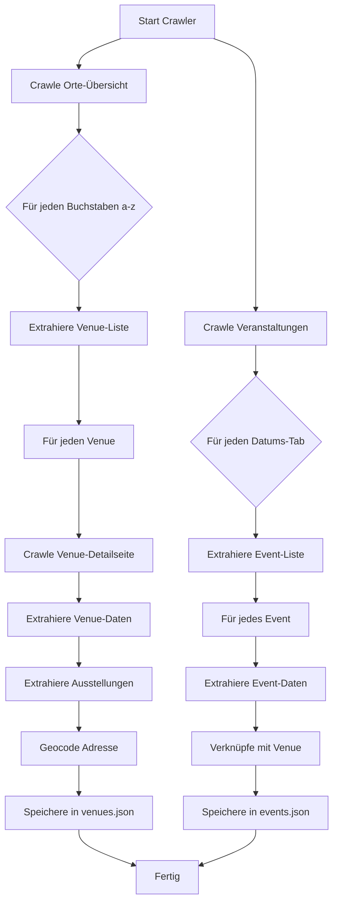

# Web-Crawler Strategie - Kulturelle Landpartie

## Übersicht

Der Crawler extrahiert alle Daten von https://kulturelle-landpartie.de und speichert sie in strukturierten JSON-Dateien.

## Crawling-Ziele

### 1. Veranstaltungsorte (Venues)
- **Quelle:** https://kulturelle-landpartie.de/orte
- **Anzahl:** ~87 Orte
- **Strategie:** Alphabetische Navigation (a-z)

### 2. Veranstaltungen (Events)
- **Quelle:** https://kulturelle-landpartie.de/veranstaltungen
- **Anzahl:** ~250+ Events
- **Strategie:** Datums-Tabs durchlaufen (29.05. - 09.06.2025)

### 3. Ausstellungen (Exhibitions)
- **Quelle:** Auf jeder Venue-Detailseite
- **Anzahl:** ~150+ Ausstellungen
- **Strategie:** Pro Venue extrahieren

## Crawling-Ablauf



## HTML-Selektoren

### Orte-Seite (Venue-Liste)

**URL-Pattern:** `https://kulturelle-landpartie.de/orte?letter={a-z}`

**Selektoren:**
```go
// Venue-Links in der Liste
venueLinks := doc.Find("a[href*='/orte/']")

// Für jeden Link:
// - href: Link zur Detailseite
// - text: Venue-Name
```

### Venue-Detailseite

**URL-Pattern:** `https://kulturelle-landpartie.de/orte/{venue-slug}`

**Selektoren:**
```go
// Venue-Name
name := doc.Find("h1").First().Text()

// Beschreibung
description := doc.Find(".venue-description").Text()

// Kontaktdaten
phone := doc.Find("a[href^='tel:']").Text()
email := doc.Find("a[href^='mailto:']").Text()
website := doc.Find("a[href^='http']").AttrOr("href", "")

// Adresse
address := doc.Find(".address").Text()
// Parsen: "Straße, PLZ Ort"

// Fahrradroute
bikeRoute := doc.Find("a[href*='fahrradtour']").Text()

// Ausstellungen
exhibitions := doc.Find(".ausstellungen .exhibition-item")
exhibitions.Each(func(i int, s *goquery.Selection) {
    title := s.Find("h3").Text()
    description := s.Find("p").Text()
    artist := s.Find(".artist").Text()
    category := s.Find(".category").Text()
})

// Events (Anzahl)
eventCount := doc.Find(".veranstaltungen").Text()
// Extrahiere Zahl aus "VERANSTALTUNGEN (9)"
```

### Veranstaltungen-Seite

**URL-Pattern:** `https://kulturelle-landpartie.de/veranstaltungen?date={YYYY-MM-DD}`

**Datums-Tabs:**
- Do-29.05. (2025-05-29)
- Fr-30.05. (2025-05-30)
- Sa-31.05. (2025-05-31)
- So-01.06. (2025-06-01)
- Mo-02.06. (2025-06-02)
- Di-03.06. (2025-06-03)
- Mi-04.06. (2025-06-04)
- Do-05.06. (2025-06-05)
- Fr-06.06. (2025-06-06)
- Sa-07.06. (2025-06-07)
- So-08.06. (2025-06-08)
- Mo-09.06. (2025-06-09)

**Selektoren:**
```go
// Event-Items
events := doc.Find(".event-item")

events.Each(func(i int, s *goquery.Selection) {
    // Datum und Zeit
    datetime := s.Find(".datetime").Text()
    // Format: "30.05. — 05:00"
    
    // Titel
    title := s.Find("h3").Text()
    
    // Beschreibung
    description := s.Find(".description").Text()
    
    // Ort
    venueName := s.Find(".venue-name").Text()
    venueLink := s.Find("a[href*='/orte/']").AttrOr("href", "")
    
    // Eintritt
    admission := s.Find(".admission").Text()
    
    // Kategorie (falls vorhanden)
    category := s.Find(".category").Text()
    
    // Bild
    imageUrl := s.Find("img").AttrOr("src", "")
})
```

## Geocoding-Strategie

### Nominatim API (OpenStreetMap)

**Endpoint:** `https://nominatim.openstreetmap.org/search`

**Parameter:**
- `q`: Vollständige Adresse
- `format`: json
- `limit`: 1
- `countrycodes`: de

**Beispiel-Request:**
```go
func geocodeAddress(address string) (lat, lng float64, err error) {
    baseURL := "https://nominatim.openstreetmap.org/search"
    
    params := url.Values{}
    params.Add("q", address)
    params.Add("format", "json")
    params.Add("limit", "1")
    params.Add("countrycodes", "de")
    
    req, _ := http.NewRequest("GET", baseURL+"?"+params.Encode(), nil)
    req.Header.Set("User-Agent", "KLP-Crawler/1.0 (kulturelle-landpartie)")
    
    // Rate-Limiting: 1 Request/Sekunde
    time.Sleep(1 * time.Second)
    
    // ... Response verarbeiten
}
```

**Response:**
```json
[
  {
    "lat": "53.0123456",
    "lon": "11.0456789",
    "display_name": "Zum Seinitz Moor 1, 29597 Stoetze, Deutschland"
  }
]
```

## Adress-Parsing

Adressen haben verschiedene Formate:
- "Zum Seinitz Moor 1, 29597 Stoetze OT Bankewitz"
- "Bahnhofstraße 12, 29456 Hitzacker"
- "Dorfstraße 5, 29482 Küsten"

**Parsing-Logik:**
```go
func parseAddress(addressStr string) Address {
    // Split bei Komma
    parts := strings.Split(addressStr, ",")
    
    street := strings.TrimSpace(parts[0])
    
    // PLZ und Ort aus zweitem Teil
    if len(parts) > 1 {
        cityPart := strings.TrimSpace(parts[1])
        
        // Regex: "PLZ Ort" oder "PLZ Ort OT Ortsteil"
        re := regexp.MustCompile(`^(\d{5})\s+(.+)$`)
        matches := re.FindStringSubmatch(cityPart)
        
        if len(matches) > 2 {
            postalCode := matches[1]
            city := matches[2]
            
            return Address{
                Street:     street,
                PostalCode: postalCode,
                City:       city,
            }
        }
    }
    
    return Address{}
}
```

## Rate-Limiting und Best Practices

### Respektvoller Crawler

```go
type Crawler struct {
    client      *http.Client
    rateLimiter *time.Ticker
    userAgent   string
}

func NewCrawler() *Crawler {
    return &Crawler{
        client: &http.Client{
            Timeout: 30 * time.Second,
        },
        rateLimiter: time.NewTicker(2 * time.Second),
        userAgent:   "KLP-Crawler/1.0 (kulturelle-landpartie)",
    }
}

func (c *Crawler) Fetch(url string) (*goquery.Document, error) {
    // Warte auf Rate-Limiter
    <-c.rateLimiter.C
    
    req, err := http.NewRequest("GET", url, nil)
    if err != nil {
        return nil, err
    }
    
    req.Header.Set("User-Agent", c.userAgent)
    
    resp, err := c.client.Do(req)
    if err != nil {
        return nil, err
    }
    defer resp.Body.Close()
    
    if resp.StatusCode != 200 {
        return nil, fmt.Errorf("status code: %d", resp.StatusCode)
    }
    
    return goquery.NewDocumentFromReader(resp.Body)
}
```

### Fehlerbehandlung

```go
func (c *Crawler) FetchWithRetry(url string, maxRetries int) (*goquery.Document, error) {
    var doc *goquery.Document
    var err error
    
    for i := 0; i < maxRetries; i++ {
        doc, err = c.Fetch(url)
        if err == nil {
            return doc, nil
        }
        
        // Exponential Backoff
        waitTime := time.Duration(math.Pow(2, float64(i))) * time.Second
        log.Printf("Retry %d/%d for %s after %v", i+1, maxRetries, url, waitTime)
        time.Sleep(waitTime)
    }
    
    return nil, fmt.Errorf("failed after %d retries: %w", maxRetries, err)
}
```

## Datenvalidierung

### Venue-Validierung

```go
func (v *Venue) Validate() error {
    if v.Name == "" {
        return errors.New("venue name is required")
    }
    
    if v.Address.PostalCode == "" {
        return errors.New("postal code is required")
    }
    
    if v.Coordinates.Lat == 0 || v.Coordinates.Lng == 0 {
        return errors.New("coordinates are required")
    }
    
    // Koordinaten-Plausibilität (Wendland-Region)
    if v.Coordinates.Lat < 52.5 || v.Coordinates.Lat > 53.5 {
        return errors.New("latitude out of expected range")
    }
    
    if v.Coordinates.Lng < 10.5 || v.Coordinates.Lng > 12.0 {
        return errors.New("longitude out of expected range")
    }
    
    return nil
}
```

### Event-Validierung

```go
func (e *Event) Validate() error {
    if e.Title == "" {
        return errors.New("event title is required")
    }
    
    if e.VenueID == "" {
        return errors.New("venue ID is required")
    }
    
    if e.Date == "" {
        return errors.New("date is required")
    }
    
    // Datum-Format prüfen
    _, err := time.Parse("2006-01-02", e.Date)
    if err != nil {
        return fmt.Errorf("invalid date format: %w", err)
    }
    
    return nil
}
```

## Logging

```go
type CrawlerLogger struct {
    logger *log.Logger
}

func (l *CrawlerLogger) Info(msg string, args ...interface{}) {
    l.logger.Printf("[INFO] "+msg, args...)
}

func (l *CrawlerLogger) Error(msg string, args ...interface{}) {
    l.logger.Printf("[ERROR] "+msg, args...)
}

func (l *CrawlerLogger) Progress(current, total int, item string) {
    percentage := float64(current) / float64(total) * 100
    l.logger.Printf("[PROGRESS] %d/%d (%.1f%%) - %s", current, total, percentage, item)
}
```

## Crawler-Ausführung

### Kommandozeilen-Interface

```go
func main() {
    var (
        outputDir = flag.String("output", "./data", "Output directory for JSON files")
        verbose   = flag.Bool("verbose", false, "Verbose logging")
        skipGeo   = flag.Bool("skip-geocoding", false, "Skip geocoding step")
    )
    flag.Parse()
    
    crawler := NewCrawler()
    
    // 1. Crawle Venues
    log.Println("Crawling venues...")
    venues, err := crawler.CrawlVenues()
    if err != nil {
        log.Fatal(err)
    }
    
    // 2. Geocode Adressen
    if !*skipGeo {
        log.Println("Geocoding addresses...")
        for i := range venues {
            lat, lng, err := geocodeAddress(venues[i].Address.String())
            if err != nil {
                log.Printf("Failed to geocode %s: %v", venues[i].Name, err)
                continue
            }
            venues[i].Coordinates.Lat = lat
            venues[i].Coordinates.Lng = lng
        }
    }
    
    // 3. Crawle Events
    log.Println("Crawling events...")
    events, err := crawler.CrawlEvents()
    if err != nil {
        log.Fatal(err)
    }
    
    // 4. Crawle Exhibitions
    log.Println("Crawling exhibitions...")
    exhibitions, err := crawler.CrawlExhibitions(venues)
    if err != nil {
        log.Fatal(err)
    }
    
    // 5. Speichere JSON-Dateien
    log.Println("Saving data...")
    saveJSON(filepath.Join(*outputDir, "venues.json"), venues)
    saveJSON(filepath.Join(*outputDir, "events.json"), events)
    saveJSON(filepath.Join(*outputDir, "exhibitions.json"), exhibitions)
    
    log.Printf("Done! Crawled %d venues, %d events, %d exhibitions",
        len(venues), len(events), len(exhibitions))
}
```

### Beispiel-Ausgabe

```
[INFO] Starting crawler...
[INFO] Crawling venues...
[PROGRESS] 1/26 (3.8%) - Letter: a
[PROGRESS] 2/26 (7.7%) - Letter: b
[INFO] Found 5 venues for letter 'b'
[PROGRESS] 3/26 (11.5%) - Letter: c
...
[INFO] Total venues found: 87
[INFO] Geocoding addresses...
[PROGRESS] 1/87 (1.1%) - Geocoding: Bankewitz
[PROGRESS] 2/87 (2.3%) - Geocoding: Belitz 4
...
[INFO] Crawling events...
[PROGRESS] 1/12 (8.3%) - Date: 2025-05-29
[INFO] Found 15 events for 2025-05-29
[PROGRESS] 2/12 (16.7%) - Date: 2025-05-30
...
[INFO] Total events found: 250
[INFO] Crawling exhibitions...
[PROGRESS] 1/87 (1.1%) - Venue: Bankewitz
[INFO] Found 3 exhibitions at Bankewitz
...
[INFO] Total exhibitions found: 150
[INFO] Saving data...
[INFO] Done! Crawled 87 venues, 250 events, 150 exhibitions
```

## Datenqualität

### Checks nach dem Crawling

```go
func validateCrawledData(venues []Venue, events []Event, exhibitions []Exhibition) error {
    // 1. Alle Venues haben Koordinaten
    for _, v := range venues {
        if v.Coordinates.Lat == 0 || v.Coordinates.Lng == 0 {
            log.Printf("WARNING: Venue %s has no coordinates", v.Name)
        }
    }
    
    // 2. Alle Events sind mit Venues verknüpft
    venueIDs := make(map[string]bool)
    for _, v := range venues {
        venueIDs[v.ID] = true
    }
    
    for _, e := range events {
        if !venueIDs[e.VenueID] {
            log.Printf("WARNING: Event %s references unknown venue %s", e.Title, e.VenueID)
        }
    }
    
    // 3. Alle Exhibitions sind mit Venues verknüpft
    for _, ex := range exhibitions {
        if !venueIDs[ex.VenueID] {
            log.Printf("WARNING: Exhibition %s references unknown venue %s", ex.Title, ex.VenueID)
        }
    }
    
    return nil
}
```

## Zusammenfassung

Der Crawler:
1. ✅ Extrahiert alle 87 Veranstaltungsorte
2. ✅ Geocoded alle Adressen zu Koordinaten
3. ✅ Crawlt alle Events aus dem Kalender
4. ✅ Extrahiert Ausstellungen von Venue-Seiten
5. ✅ Validiert und speichert Daten als JSON
6. ✅ Respektiert Rate-Limits und Best Practices
7. ✅ Bietet Fehlerbehandlung und Logging
