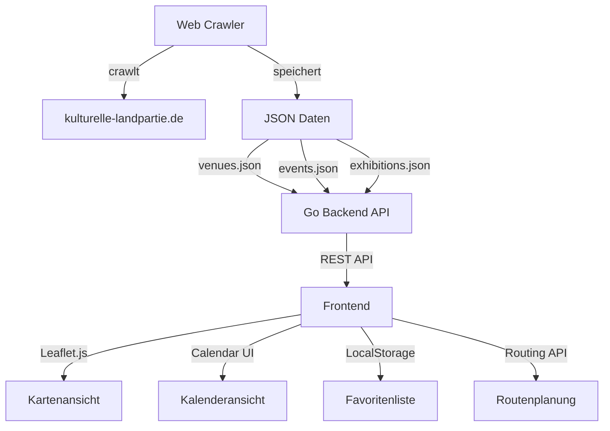
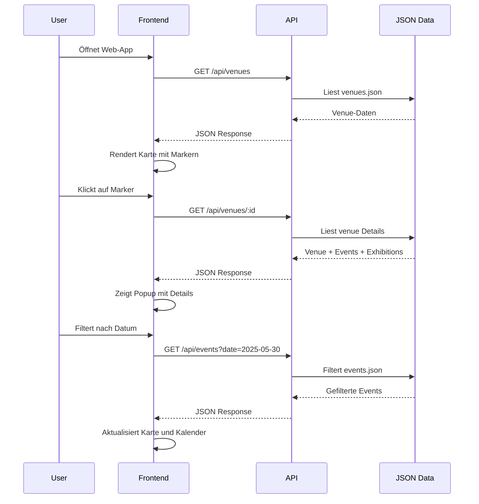

# Kulturelle Landpartie Web-App - Architekturplan

## Projektübersicht

Entwicklung einer modernen Web-Anwendung für das Kulturfestival "Kulturelle Landpartie" mit folgenden Hauptfunktionen:
- Interaktive Karte aller 87 Veranstaltungsorte
- Kalenderansicht für Events und Ausstellungen
- Filter- und Suchfunktionen
- Favoritenliste
- Routenplanung zwischen Venues

**Technologie-Stack:**
- Backend: Go (Golang)
- Frontend: HTML/CSS/JavaScript mit Leaflet.js
- Datenspeicherung: JSON-Dateien
- Mapping: Leaflet.js + OpenStreetMap

## Systemarchitektur



## Datenmodell

### Venue (Veranstaltungsort)
```json
{
  "id": "string",
  "name": "string",
  "description": "string",
  "address": {
    "street": "string",
    "postalCode": "string",
    "city": "string"
  },
  "coordinates": {
    "lat": "float64",
    "lng": "float64"
  },
  "contact": {
    "phone": "string",
    "email": "string",
    "website": "string"
  },
  "amenities": ["string"],
  "bikeRoute": "string",
  "events": ["event_id"],
  "exhibitions": ["exhibition_id"]
}
```

### Event (Veranstaltung)
```json
{
  "id": "string",
  "title": "string",
  "description": "string",
  "venueId": "string",
  "date": "ISO8601",
  "startTime": "string",
  "endTime": "string",
  "category": "string",
  "admission": "string",
  "imageUrl": "string"
}
```

### Exhibition (Ausstellung)
```json
{
  "id": "string",
  "title": "string",
  "description": "string",
  "venueId": "string",
  "artist": "string",
  "category": "string",
  "imageUrl": "string"
}
```

## Projektstruktur

```
klp/
├── cmd/
│   ├── crawler/
│   │   └── main.go              # Web Crawler Hauptprogramm
│   └── server/
│       └── main.go              # Web Server Hauptprogramm
├── internal/
│   ├── crawler/
│   │   ├── scraper.go           # HTML Parsing Logik
│   │   ├── geocoder.go          # Adresse zu Koordinaten
│   │   └── models.go            # Datenstrukturen
│   ├── api/
│   │   ├── handlers.go          # HTTP Handler
│   │   ├── routes.go            # API Routen
│   │   └── middleware.go        # CORS, Logging, etc.
│   └── storage/
│       ├── json.go              # JSON Datei I/O
│       └── models.go            # Datenmodelle
├── web/
│   ├── static/
│   │   ├── css/
│   │   │   └── styles.css       # Haupt-Stylesheet
│   │   ├── js/
│   │   │   ├── app.js           # Hauptanwendung
│   │   │   ├── map.js           # Kartenfunktionalität
│   │   │   ├── calendar.js      # Kalenderansicht
│   │   │   ├── filters.js       # Filter & Suche
│   │   │   ├── favorites.js     # Favoritenverwaltung
│   │   │   └── routing.js       # Routenplanung
│   │   └── images/
│   └── templates/
│       └── index.html           # Haupt-HTML-Template
├── data/
│   ├── venues.json              # Gecrawlte Venue-Daten
│   ├── events.json              # Gecrawlte Event-Daten
│   └── exhibitions.json         # Gecrawlte Ausstellungsdaten
├── go.mod
├── go.sum
└── README.md
```

## Detaillierte Implementierungsschritte

### 1. Projektstruktur und Entwicklungsumgebung einrichten

**Aufgaben:**
- Go-Projekt initialisieren mit `go mod init`
- Verzeichnisstruktur erstellen
- Benötigte Go-Dependencies installieren:
  - `github.com/PuerkitoBio/goquery` - HTML Parsing
  - `github.com/gorilla/mux` - HTTP Router
  - `github.com/rs/cors` - CORS Middleware
- Git-Repository initialisieren mit `.gitignore`

**Dateien:**
- [`go.mod`](go.mod)
- [`go.sum`](go.sum)
- [`.gitignore`](.gitignore)
- [`README.md`](README.md)

### 2. Web-Crawler für kulturelle-landpartie.de entwickeln

**Aufgaben:**
- Crawler für Orte-Seite implementieren (alle Buchstaben a-z durchlaufen)
- HTML-Parsing für Venue-Details:
  - Name, Beschreibung
  - Adresse (Straße, PLZ, Ort)
  - Kontaktdaten (Telefon, E-Mail, Website)
  - Fahrradroute-Information
- Crawler für Veranstaltungen (alle Datumstabs durchlaufen)
- Crawler für Ausstellungen pro Venue
- Geocoding-Integration für Koordinaten (z.B. Nominatim API)
- Rate-Limiting implementieren (respektvoller Crawler)
- Fehlerbehandlung und Logging

**Dateien:**
- [`cmd/crawler/main.go`](cmd/crawler/main.go)
- [`internal/crawler/scraper.go`](internal/crawler/scraper.go)
- [`internal/crawler/geocoder.go`](internal/crawler/geocoder.go)
- [`internal/crawler/models.go`](internal/crawler/models.go)

**Crawling-Strategie:**
1. Orte-Seite: Alle Buchstaben (a-z) durchlaufen
2. Für jeden Ort: Detailseite aufrufen und parsen
3. Veranstaltungen: Alle Datumstabs durchlaufen
4. Koordinaten: Geocoding für jede Adresse
5. Daten in JSON-Dateien speichern

### 3. Datenmodell und JSON-Schema definieren

**Aufgaben:**
- Go-Structs für Venue, Event, Exhibition definieren
- JSON-Tags für Serialisierung hinzufügen
- Validierungsfunktionen implementieren
- Helper-Funktionen für Datenmanipulation
- ID-Generierung (z.B. UUID oder Hash)

**Dateien:**
- [`internal/storage/models.go`](internal/storage/models.go)
- [`internal/storage/json.go`](internal/storage/json.go)

### 4. Backend-API in Go implementieren

**API-Endpunkte:**

```
GET  /api/venues              - Alle Venues abrufen
GET  /api/venues/:id          - Einzelnen Venue abrufen
GET  /api/events              - Alle Events abrufen (mit Datum-Filter)
GET  /api/events/:id          - Einzelnes Event abrufen
GET  /api/exhibitions         - Alle Ausstellungen abrufen
GET  /api/exhibitions/:id     - Einzelne Ausstellung abrufen
GET  /api/search?q=...        - Suche über alle Daten
GET  /api/filter?date=...&category=... - Gefilterte Ergebnisse
```

**Aufgaben:**
- HTTP-Server mit Gorilla Mux einrichten
- API-Handler implementieren
- CORS-Middleware konfigurieren
- JSON-Response-Helper
- Query-Parameter-Parsing für Filter
- Statische Dateien servieren
- Logging-Middleware

**Dateien:**
- [`cmd/server/main.go`](cmd/server/main.go)
- [`internal/api/handlers.go`](internal/api/handlers.go)
- [`internal/api/routes.go`](internal/api/routes.go)
- [`internal/api/middleware.go`](internal/api/middleware.go)

### 5. Frontend mit Kartenansicht entwickeln

**Aufgaben:**
- HTML-Grundstruktur erstellen
- Leaflet.js einbinden
- Karte initialisieren (zentriert auf Wendland)
- Marker für alle Venues hinzufügen
- Custom Marker-Icons (optional)
- Popup-Fenster mit Venue-Details
- Marker-Clustering für bessere Performance
- Zoom- und Pan-Funktionalität

**Dateien:**
- [`web/templates/index.html`](web/templates/index.html)
- [`web/static/js/map.js`](web/static/js/map.js)
- [`web/static/css/styles.css`](web/static/css/styles.css)

**Leaflet.js Features:**
- OpenStreetMap Tiles
- Marker mit Popup-Informationen
- Marker-Clustering (Leaflet.markercluster)
- Custom Icons für verschiedene Kategorien

### 6. Kalenderansicht implementieren

**Aufgaben:**
- Kalender-UI erstellen (Grid-Layout oder Library)
- Events nach Datum gruppieren
- Tagesansicht mit allen Events
- Event-Details in Modal/Sidebar anzeigen
- Navigation zwischen Tagen/Wochen
- Heute-Markierung
- Integration mit Kartenansicht (Event anklicken → Karte zentrieren)

**Dateien:**
- [`web/static/js/calendar.js`](web/static/js/calendar.js)

**Kalender-Features:**
- Monatsübersicht mit Event-Anzahl pro Tag
- Tagesdetailansicht
- Event-Kategorien farblich markiert
- Klick auf Event → Details + Karte

### 7. Filter- und Suchfunktionen hinzufügen

**Aufgaben:**
- Suchleiste für Freitextsuche implementieren
- Filter-Panel erstellen:
  - Datum (Datumsbereich)
  - Kategorie (Musik, Kunst, Theater, etc.)
  - Ort (Dropdown mit allen Venues)
  - Amenities (Fahrradroute, etc.)
- Filter-Logik im Frontend
- API-Aufrufe mit Query-Parametern
- Ergebnisse in Karte und Liste aktualisieren
- Filter zurücksetzen-Button

**Dateien:**
- [`web/static/js/filters.js`](web/static/js/filters.js)

**Filter-Optionen:**
- Datum: Von-Bis Datumsauswahl
- Kategorie: Checkboxen für Event-Typen
- Ort: Autocomplete-Suche
- Freitext: Suche in Titel und Beschreibung

### 8. Favoritenliste-Feature implementieren

**Aufgaben:**
- LocalStorage für Favoriten nutzen
- Favoriten-Button bei jedem Venue/Event
- Favoriten-Sidebar/Panel
- Favoriten speichern/laden
- Favoriten löschen
- Favoriten-Marker auf Karte hervorheben
- Export-Funktion (optional: als JSON)

**Dateien:**
- [`web/static/js/favorites.js`](web/static/js/favorites.js)

**Favoriten-Features:**
- Herz-Icon zum Hinzufügen/Entfernen
- Persistierung in LocalStorage
- Favoriten-Übersicht
- Favoriten auf Karte filtern

### 9. Routenplanung zwischen Venues integrieren

**Aufgaben:**
- Leaflet Routing Machine einbinden
- Start- und Ziel-Venue auswählen
- Route auf Karte anzeigen
- Distanz und geschätzte Zeit anzeigen
- Fahrrad-Routing bevorzugen
- Mehrere Venues als Wegpunkte (Tour-Planung)
- Route exportieren (GPX optional)

**Dateien:**
- [`web/static/js/routing.js`](web/static/js/routing.js)

**Routing-Features:**
- Leaflet Routing Machine mit OSRM
- Fahrrad-Routing-Profil
- Wegpunkte hinzufügen/entfernen
- Route-Anweisungen anzeigen

### 10. Responsive Design und UI-Optimierung

**Aufgaben:**
- Mobile-First CSS-Design
- Responsive Breakpoints definieren
- Touch-Gesten für Karte optimieren
- Navigation für Mobile (Hamburger-Menü)
- Performance-Optimierung:
  - Lazy Loading für Bilder
  - Marker-Clustering
  - Debouncing für Suche
- Accessibility (ARIA-Labels, Keyboard-Navigation)
- Loading-States und Spinner
- Error-Handling im UI

**Dateien:**
- [`web/static/css/styles.css`](web/static/css/styles.css)
- [`web/static/js/app.js`](web/static/js/app.js)

**Responsive Breakpoints:**
- Mobile: < 768px
- Tablet: 768px - 1024px
- Desktop: > 1024px

### 11. Testing und Deployment vorbereiten

**Aufgaben:**
- Unit-Tests für Go-Backend schreiben
- Integration-Tests für API
- Frontend-Tests (optional: mit Jest)
- Build-Script erstellen
- Deployment-Dokumentation
- Docker-Container erstellen (optional)
- Systemd-Service-Datei (für Linux-Server)
- Nginx-Konfiguration als Reverse-Proxy
- SSL/TLS-Zertifikat einrichten (Let's Encrypt)

**Dateien:**
- [`Dockerfile`](Dockerfile) (optional)
- [`deploy.sh`](deploy.sh)
- [`systemd/klp.service`](systemd/klp.service)

## Technische Details

### Go-Dependencies

```go
require (
    github.com/PuerkitoBio/goquery v1.8.1
    github.com/gorilla/mux v1.8.1
    github.com/rs/cors v1.10.1
)
```

### Frontend-Dependencies (CDN)

- Leaflet.js v1.9.4
- Leaflet.markercluster v1.5.3
- Leaflet Routing Machine v3.2.12
- Font Awesome (Icons)

### Geocoding

Für die Umwandlung von Adressen in Koordinaten:
- **Nominatim API** (OpenStreetMap)
- Rate-Limit: 1 Request/Sekunde
- User-Agent setzen

### Crawler Best Practices

- User-Agent setzen: `KLP-Crawler/1.0`
- Rate-Limiting: 1-2 Sekunden zwischen Requests
- Robots.txt respektieren
- Fehlerbehandlung für 404, 500, etc.
- Retry-Logik mit Exponential Backoff

## Deployment-Optionen

### Option 1: Einfacher VPS
- Go-Binary kompilieren
- Systemd-Service einrichten
- Nginx als Reverse-Proxy
- Let's Encrypt für SSL

### Option 2: Docker
- Multi-Stage Build
- Docker Compose für einfaches Deployment
- Volume für JSON-Daten

### Option 3: Statisches Hosting + API
- Frontend auf Netlify/Vercel
- Backend auf Fly.io/Railway

## Sicherheitsüberlegungen

- CORS richtig konfigurieren
- Rate-Limiting für API
- Input-Validierung
- XSS-Schutz (Content-Security-Policy)
- HTTPS erzwingen

## Performance-Optimierungen

- Gzip-Kompression für API-Responses
- Browser-Caching für statische Assets
- Marker-Clustering für Karte
- Lazy Loading für Bilder
- Debouncing für Suche (300ms)
- JSON-Daten minimieren

## Zukünftige Erweiterungen

- Push-Benachrichtigungen für Events
- Offline-Modus (PWA)
- Mehrsprachigkeit (i18n)
- Admin-Panel für Datenbearbeitung
- Benutzerkonten und Bewertungen
- Social-Media-Integration
- Analytics und Statistiken

## Mermaid-Diagramm: Datenfluss



## Zusammenfassung

Dieses Projekt erstellt eine moderne, benutzerfreundliche Web-Anwendung für die Kulturelle Landpartie mit:

✅ **Web-Crawler** zum Extrahieren aller Daten von der bestehenden Website  
✅ **Go-Backend** mit RESTful API  
✅ **Interaktive Karte** mit Leaflet.js und OpenStreetMap  
✅ **Kalenderansicht** für alle Events  
✅ **Filter und Suche** für bessere Navigation  
✅ **Favoritenliste** mit LocalStorage  
✅ **Routenplanung** zwischen Veranstaltungsorten  
✅ **Responsive Design** für alle Geräte  

Die Architektur ist modular, erweiterbar und folgt Go-Best-Practices.
